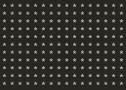

# badapple-term
Miniature self-contained badapple player running in cmd/terminal.

## Building
Either:
- Ensure there is `ffmpeg`, `gcc` and `python` (with Pillow library) available on the path.
	- one way of doing that is to create a virtual env and install Pillow: 
	*Windows*: `python -m venv venv/ && venv\Scripts\activate && pip install Pillow` 
	*Linux*: `python -m venv venv && . venv/bin/activate && pip install Pillow`
- Run `make`.
	- creates frames from the .mp4, packs them, and creates the C array for embedding (if chosen)

### Build steps in more detail

#### Data
To generate the data for embedding first run the `ffmpeg -i ./badapple.mp4 -r 30 -vf scale=16:-1 ./frames/output_%04d.png`.

Then run `compile_map.py` (requires the Pillow library `pip install Pillow`) and it will use those extracted frames to generate the `map.bin` file.

To embed that data into the program you can either:

a) Compile the source using `-std=c23` standard and define `EMBED_USING_C23_EMBED_KEYWORD` which will use the `#embed` to embed the `map.bin` into the source, or

b) Run the `bin_to_code.py` which will create a file with C array (`embed.c`) that will be included when compiling the main source.

#### Video
On Windows we only need to additionally link against `-lwinmm` (Windows Multimedia library) since we utilize `timeBeginPeriod` and `timeEndPeriod` functions for better `Sleep()` resolution.

If you decided to use C23 `#embed` you will also have to add the `-std=c23` flag.

## Format
Since the image is monochrome, every 8 pixels of each frame can be packed into bits of a single byte to reduce size. This means that each frame of size 16x12 pixels will actually require 24 bytes in the "compressed" data binary.

This is certainly not the best we can do but there is no incentive to do better since
1) This is intended to be displayed on a 16x16 led strip board (ATmega2560) and
2) This is already quite a bit better that the original size.
